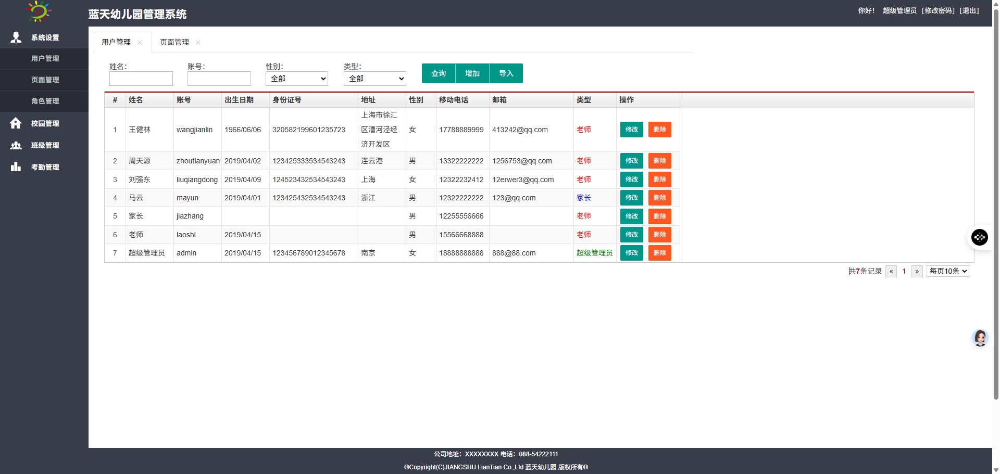

# 源码链接 https://mbd.pub/o/bread/YZWXlZtsbQ==
# 蓝天幼儿园管理系统 (BSKMS)

## 项目概述
蓝天幼儿园管理系统是一个基于Spring Boot的幼儿园综合管理平台，采用前后端分离架构，提供完整的幼儿园日常管理功能。系统涵盖了学生管理、教师管理、课程安排、饮食管理、物资管理等多个方面，为幼儿园提供全方位的数字化管理解决方案。

## 技术栈

### 后端技术
- **框架**: Spring Boot 2.1.3.RELEASE
- **安全框架**: Apache Shiro 1.3.2 (权限控制)
- **ORM框架**: MyBatis + PageHelper分页插件
- **数据库**: MySQL 5.7+
- **数据源**: Alibaba Druid 1.1.12
- **模板引擎**: Thymeleaf
- **JSON处理**: FastJSON 1.2.57
- **Excel处理**: Apache POI 4.0.1

### 前端技术
- **UI框架**: LayUI 2.4.5
- **JavaScript库**: jQuery
- **弹层组件**: Layer
- **树形组件**: zTree

### 开发工具
- **JDK版本**: 1.8+
- **构建工具**: Maven
- **IDE支持**: IntelliJ IDEA / Eclipse

## 功能模块

### 1. 系统管理模块
- 用户管理：用户信息的增删改查
- 角色管理：角色权限配置
- 页面管理：系统页面权限控制
- 权限控制：基于Shiro的细粒度权限管理

### 2. 班级管理模块
- 班级信息维护：班级基本信息管理
- 班主任分配：班主任人员配置
- 班级位置管理：教室位置记录
- 学生数量统计：班级学生人数管理

### 3. 学生管理模块
- 学生信息管理：学生基本信息维护
- 兴趣爱好记录：学生特长爱好记录
- 食物过敏信息：学生饮食禁忌管理
- 入学时间管理：学生入学时间记录

### 4. 教师管理模块
- 教师信息管理：教师基本信息维护
- 科目分配：教师任教科目配置
- 班级任教：教师与班级关联管理

### 5. 课程管理模块
- 课程安排：每日课程时间安排
- 教师分配：课程教师配置
- 时间管理：上课下课时间设置
- 节次管理：课程节次安排

### 6. 家长端功能模块
- 校园信息查看：学校基本信息展示
- 签到签退：学生到校离校签到
- 课程表查看：学生课程安排查询
- 饮食信息：每日食谱查看
- 通知公告：学校通知信息查看
- 个人信息管理：家长信息维护

### 7. 饮食管理模块
- 每日食谱：早餐、午餐、晚餐配置
- 营养成分：食物营养成分说明
- 配料信息：食材配料记录
- 饮食备注：特殊饮食要求记录

### 8. 物资管理模块
- 物资信息维护：物资基本信息管理

### 9. 通知公告模块
- 公告发布：学校通知发布
- 内容管理：公告内容维护
- 发布时间：公告发布时间记录

## 数据库设计

### 主要数据表结构

#### 1. 用户表 (user)
- 用户ID、用户名、密码、电话、生日等信息
- 用户状态和角色信息

#### 2. 学生表 (children)
- 学生ID、姓名、性别、生日
- 班级ID、兴趣爱好、食物禁忌
- 入学时间

#### 3. 班级表 (classes)
- 班级ID、班级名称
- 班主任ID、班级描述
- 学生数量、班级位置、创建时间

#### 4. 课程表 (course)
- 课程ID、课程名称、教师姓名
- 上课时间、下课时间、节次
- 上午下午标识、班级ID

#### 5. 饮食表 (foot)
- 早餐、午餐、晚餐内容
- 配料信息和营养成分
- 创建时间

#### 6. 物资表 (material)
- 物资名称、数量、单价
- 来源、描述、创建时间

#### 7. 通知表 (notice)
- 通知标题、内容
- 创建时间

#### 8. 签到表 (sign)
- 签到类型（签到/签退）
- 签到时间、状态
- 签到人员信息

#### 9. 权限表 (page)
- 页面ID、父页面ID
- 页面名称、URL地址
- 页面层级、索引、删除标志

## 项目结构

```
bskms-master/
├── src/main/java/com/bskms/
│   ├── bean/          # 实体类
│   ├── common/         # 通用工具类
│   ├── config/         # 配置类
│   ├── controller/     # 控制器层
│   ├── filter/         # 过滤器
│   ├── interceptor/    # 拦截器
│   ├── listener/       # 监听器
│   ├── mapper/         # MyBatis映射接口
│   ├── model/          # 数据模型
│   ├── service/        # 服务层
│   ├── shiro/          # Shiro配置
│   └── utils/          # 工具类
├── src/main/resources/ # 资源文件
│   ├── static/         # 静态资源
│   └── templates/      # 模板文件
├── bskms-2019-06-22.sql # 数据库脚本
└── pom.xml            # Maven配置
```

## 安装部署

### 环境要求
- JDK 1.8或更高版本
- MySQL 5.7或更高版本
- Maven 3.5或更高版本

### 数据库配置
1. 创建MySQL数据库：`bskms`
2. 执行SQL脚本：`bskms-2019-06-22.sql`
3. 修改配置文件中的数据库连接信息

### 配置文件
编辑 `src/main/resources/application.properties`：

```properties
# 数据库配置
spring.datasource.url=jdbc:mysql://localhost:3306/bskms
spring.datasource.username=root
spring.datasource.password=your_password

# 其他配置...
```

### 运行项目

#### 方式一：使用Maven
```bash
mvn clean package
java -jar target/bskms.jar
```

#### 方式二：使用Spring Boot Maven插件
```bash
mvn spring-boot:run
```

#### 方式三：直接运行主类
运行 `BskmsApplication.java` 中的main方法

### 访问系统
- 系统地址：http://localhost:8080
- 默认用户：根据数据库初始化脚本中的用户信息


## 系统界面展示

### 登录界面


### 系统首页


### 班级管理


### 学生管理


### 教师管理


### 课程安排


### 饮食管理


### 物资管理


### 通知公告


### 家长端界面


### 签到功能


### 权限管理


### 数据统计


### 系统设置

